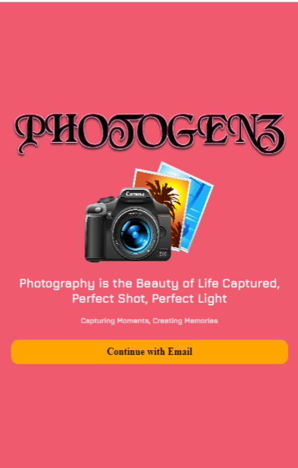
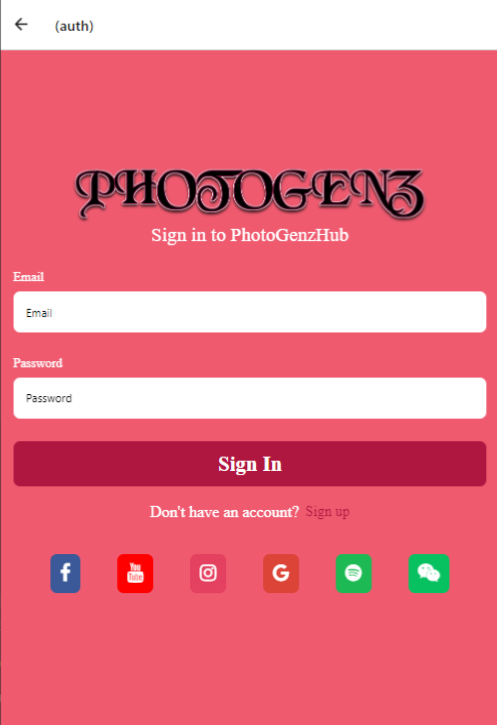
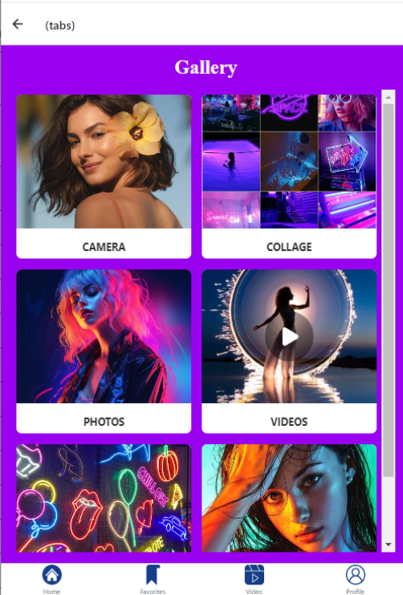
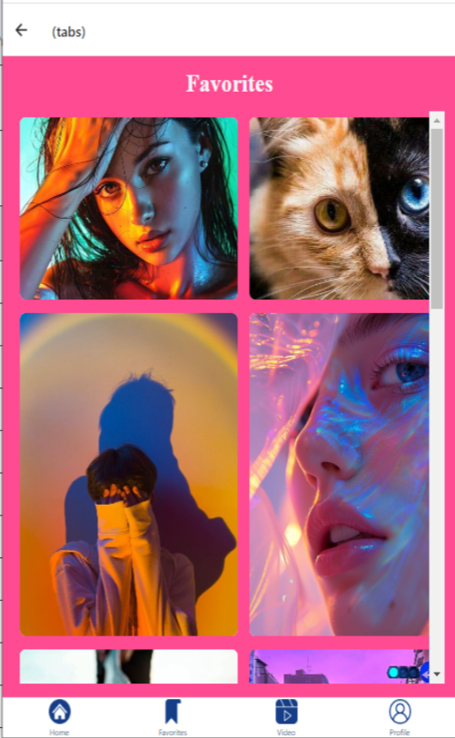
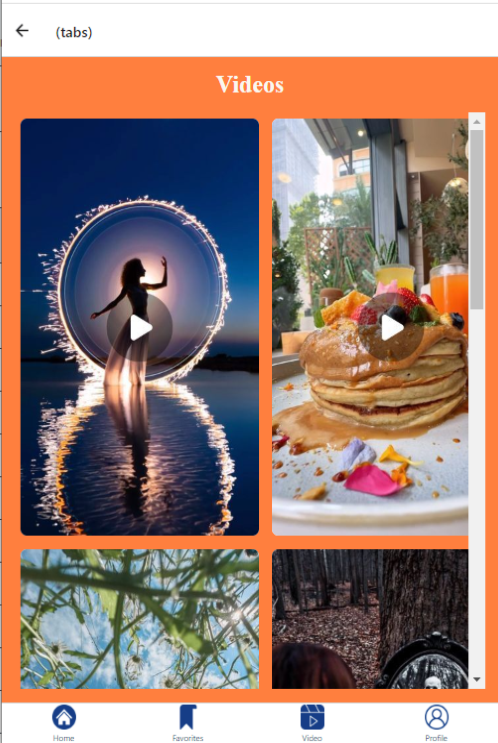
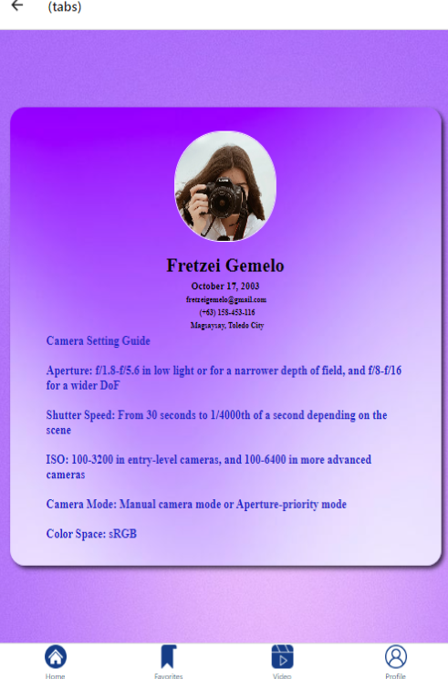

# PHOTOGENZ Hub
PhotoGenZ Mobile App.

# Features
* Upload Multiple Photos, Videos, Or Designs As Part Of A Project
* Encourages Collaboration And Connection Among Photographers
* Rewards Exceptional Work And Motivates The Community
* Photographers For Inspiration Or Collaboration

# Course Overview
* Basic React Native Components
* Database Design using Appwrite
* User Registration & Authenticaiton
* Deployment

# Tech Stack
* React Native
* AppWrite
* HTML, CSS and JS

# Video Upload App
https://youtube.com/shorts/iIEM25tCIZc

# Home Screen
  

# Sign Up Screen
  

# Sign In Screen
  

# Tabs Screen
  
  
  
  
